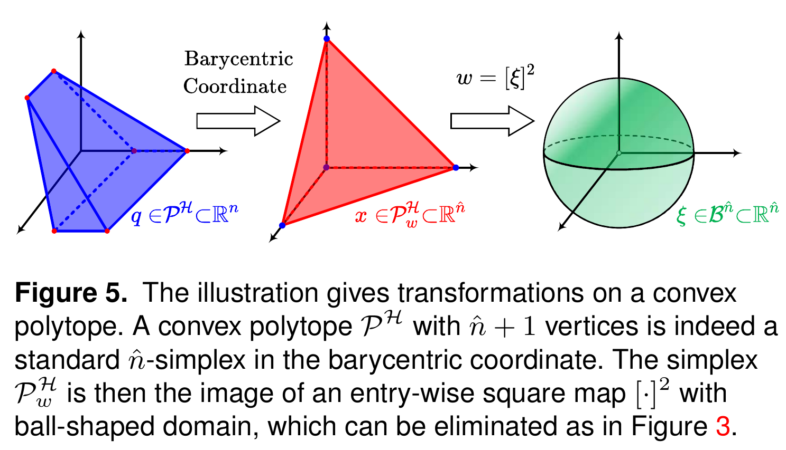
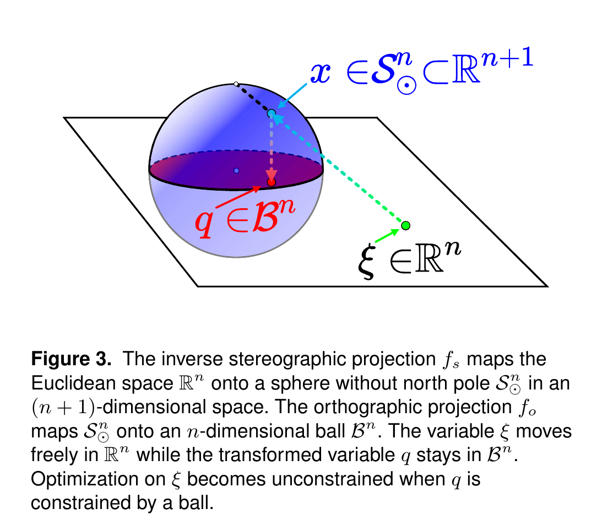
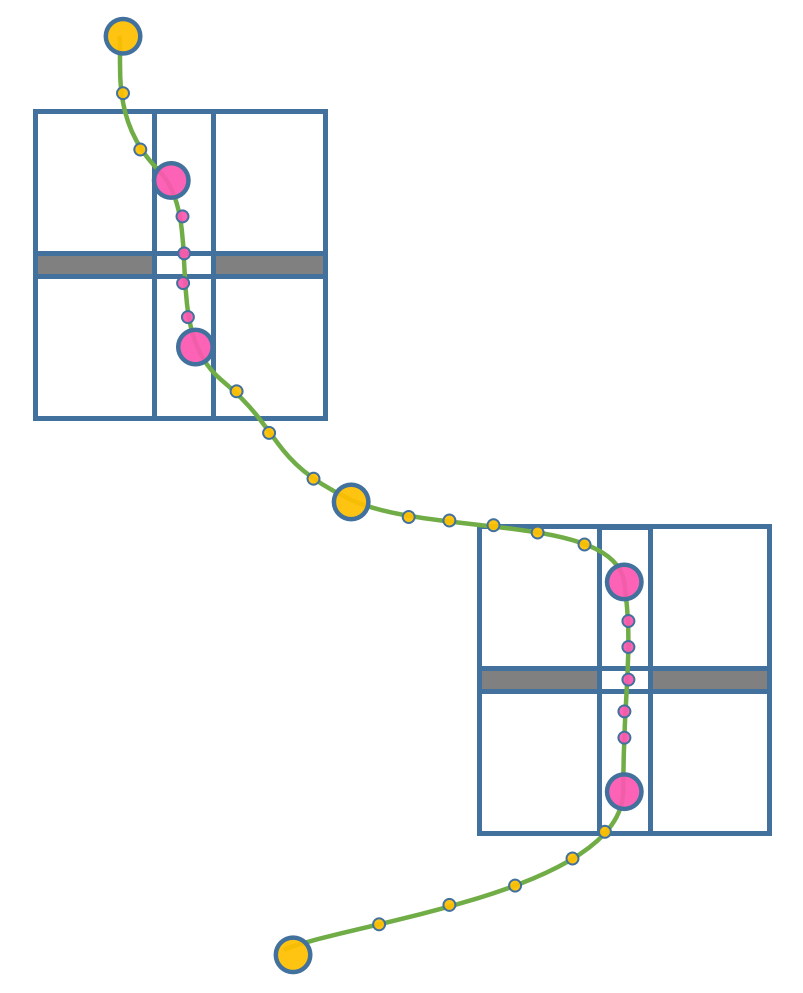

[toc]

# poly_traj_utils

多项式轨迹工具库，包含多项式轨迹数据结构，多项式轨迹优化，多项式轨迹可视化样例等几个部分。

优化部分包含三个包

* BVO SOLVER
  * 一个经过大量测试的BVP生成库，包含MInjerk和Minsnap两种轨迹生成，自动时间分配。
* AM
  * 交替优化库，包含五阶多项式和七阶多项式。
* qnmopt
  * 基于minco框架的拟牛顿法优化。

# MINCO-Waypoint

# 1 MINCO-SFC

MINCO中的SFC约束需要经过三次坐标变化

首先是从多面体描述转化为顶点描述。即从笛卡尔坐标系转化为Barycentric，原理是空间内任意一点可以表示为顶点的线性组合，并且当系数都大于0，则可以判断该点在多面体内部。

> https://zhuanlan.zhihu.com/p/149836719

与是将原本的超平面约束，转化为了顶点约束。而顶点约束又可以通过

>423–434.
>Sisser FS (1981) Elimination of bounds in optimization problems
>by transforming variables. Mathematical Programming 20(1):
>110–121.

的方法转化为球面约束。随后对于球面约束，可以使用球极映射转化为降维度的平面约束。

# 2 MINCO-waypoint

相对而言，waypoint的约束就更加容易实现了。直接将时间和自由状态点作为优化变量。

# 3 部分走廊约束的minco

将轨迹分成两类，一类是自由轨迹，只约束部分waypoint，另一类是SE3轨迹，需要加入走廊约束。那么整个轨迹优化问题就需要将轨迹分类

其中保证走廊约束的轨迹都在走廊内部的方法是在轨迹上sample一些waypoint，并优化这些waypoint的全状态。

粉色小球是要积分全状态的，包括位置的走廊cost，黄色小球则只需要积分速度和加速度的超出约束。

